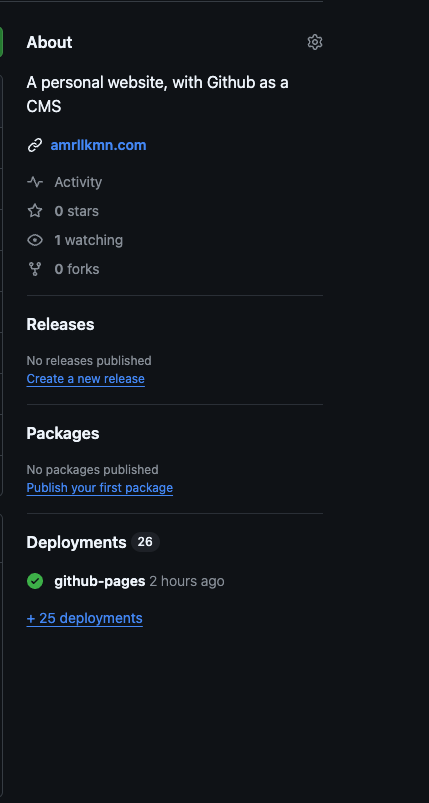

It's been a while since I've had a portfolio website. I had one when I was trying to get my first dev job but shut it down as soon as I got employed (read: _too lazy to maintain it_). So this is my attempt at a revival.

## Why GitHub?

I was inspired to use GitHub following this article by [PostHog](https://posthog.com/blog/github-cms?utm_source=pointer&utm_medium=newsletter). They use it as a way to manage their content as the tools GitHub provide fits their content workflow. Seeing this, I thought why not?

Through GitHub, I can:

- Create/update/delete posts as a pull request.
- Run GitHub Actions to deploy the changes.
- Host the page on GitHub Pages.
- No need to worry about maintainence.
- Getting a domain name becomes optional (_for now_).

Now all I need is a static site generator.

## Enter Hugo

Hugo is a static site generator powered by Go. It's pretty easy to use, with a lot of customisable templates that can provide various functionalities. I started with this [documentation](https://gohugo.io/getting-started/quick-start/) to install Hugo, picked a template, and just went from there. I won't go too deep into how to use Hugo, as the documentation is pretty in depth and dependent on what template you've used.

## Building the site

After picking a template, I started with playing around with the configurations and customising the template (adding favicons, changing color schemes, adding assets, .etc) until I was happy with how it looked out through running this command:

```bash
hugo server
```

From here, we can start going about how to deploy our static site.

## Deployment

Lucky for me, Hugo can be deployed through automation using GitHub Actions. So in my project folder, I created a folder called `.github` and added my workflow there. The folder structure should look like this:

```
├── .github
│   └── workflow
│       └── gh-pages.yml
├── archetypes
├── assets
...
```

In `gh-pages.yml`, I copied the workflow from Hugo's own [documentation](https://gohugo.io/hosting-and-deployment/hosting-on-github/) (like I said, it's pretty in depth). In the file the event target is on a push to `main` branch of your project's repo. So make sure the changes you've made and this workflow files will be pushed to main for the automation to trigger. If done correctly, you would see this on your repo page:



Now, just check your GitHub Pages URL (probably something like `https://{github_username}.github.io/{repo_name}`). You're all set!
