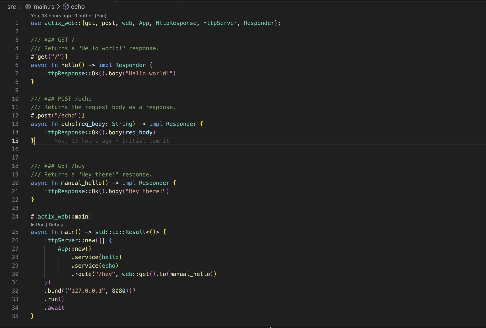
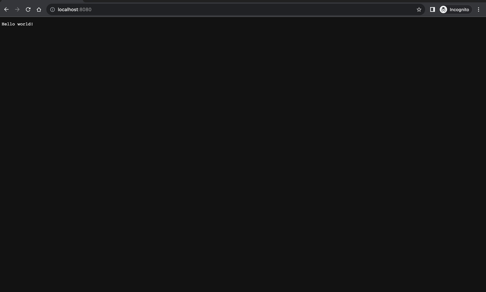

> TL;DR: I got a simple Rust web server up and running.

## First steps
I chose the framework [Actix Web](https://actix.rs) to build the web server. The justification was mainly because of the benchmarking done [here](https://github.com/programatik29/rust-web-benchmarks). Plus, there were a lot of tutorials that were built on top of this framework so it would be easier for me to follow along. The documentation was also straightforward. I first created a new Rust project with `cargo new url-shortener-v2`. Then, I added the Actix Web crate to my `Cargo.toml` and followed the [Getting Started](https://actix.rs/docs/getting-started/) guide on the Actix Web website.
At the end of the guide, you should have this:

Then, run `cargo run` on your terminal and go to `localhost:8080`. You should see the "Hello World" message:

## Next steps
Now that we've got a simple hello world server running, this should be a good place to stop for now. I'll be back with more updates soon.