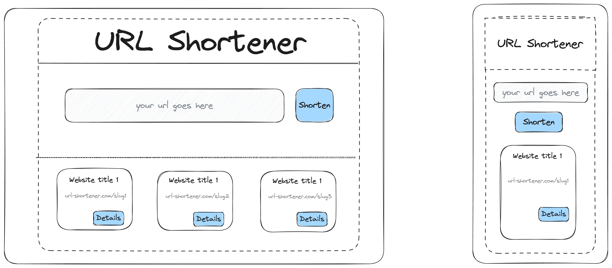

> TL;DR: I'm going to rebuild my URL shortener app in Rust. I'm going to document my journey here.

I've been wanting to learn Rust for a while now. I've been reading the book and I've been watching a lot of videos on it. I think it's time to put my knowledge to the test and build something with it.

## Why Rust?
I'm not going to list out the typical reasons people jump into Rust (memory-safety, zero-cost abstractions, etc.). The simple reason I chose Rust it's purely because I don't have much experience with any systems programming language and I want to add it to my toolbox. Understandably, I'm going to have a harder time building something since my experience with C and C++ were limited (It's been 4 years to be exact). It's going to be hard, but doing the hard stuff is when I learn the most.

## What am I going to build or rebuild?
Around April, I've built a URL shortener app with Rails and Next.js. When I built it, it was done with most amount of decisions made for me (using a single-click deployment platforms such as Vercel and Render). Not that it's bad, but it was for a job interview and I needed it done quickly. Now that I have the time, I want to rebuild it in Rust. So here's the rules I've set for myself:
- I'm going to build the backend service in Rust
- Keep the frontend service in Next.js, but revamp the UI (I've been learning alot about grid systems and I want to try it out)
- Deploy the backend service on AWS (I feel that infrastructure is going to be a good thing to learn as I'm going).
- Re-deploy the front-end on AWS (I'm familiar with Amplify, but if it starts to get pricey, I'll have to find something else.)
- Add the domain name to the app (I'm going to use my own domain name for this)

This is a big list of stuff to do, it's going to take a while, but I got the time.

## What's next?
I've been drawing out what I want the app to look like. I don't know if I'll keep the colors and fonts but I do want to simplify the UI even more and use grid systems so that I can have a more responsive UI. Recently, I worked on a project that required me to use a grid system to quickly snap to a layout depending on the user's screen size. I'm going to use it here as well.

As for the backend, I'm going to try and keep as much as the features implemented in Rails as possible. I don't have a slightest clue on how to implement a web app in Rust, what frameworks to use, but I'm going to try and keep it as simple as possible. I've been looking at popular Rust web libraries like [Actix Web](https://actix.rs/), [Warp](https://github.com/seanmonstar/warp), and even [Rocket](https://rocket.rs/).

For deployment, I do know that I want to use AWS for this, I just don't know how to do it yet. So far, I'm interested in learning how to use ECS so that I can just deploy the app as a container. That way, I can simplify the deployment process through CI/CD, but as I go along it might be unnecessary and I might just deploy with a simple EC2 instance. I'll have to see.

That's all I have for now. This will be a multi-part series (because content), so stay tuned for more updates.

P.S: I haven't written anything in a while bear with me.