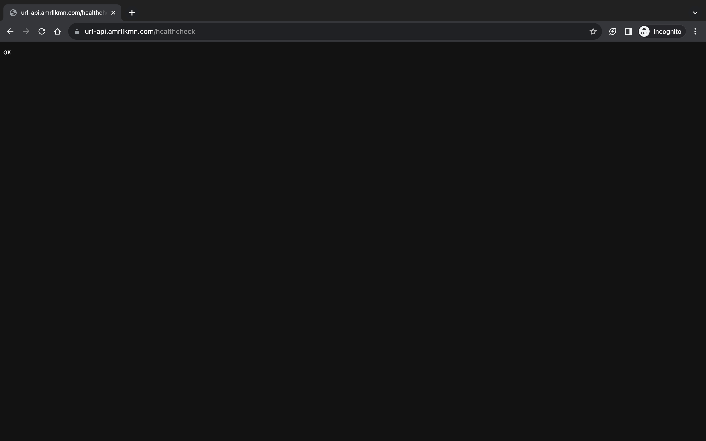

> TL;DR: I setup an AWS EC2 instance with an NGINX reverse proxy to serve the app.


## Introduction
 I knew early on that I needed infrastructure for my app to serve requests to the public. Thus, I decided to pivot and focus on creating a server for the app. As discussed in my previous posts, I chose Amazon Web Services (AWS) as my platform of choice. My goal was not only to make my app functional but also to gain hands-on experience in the process.
 
## Step 1: Choosing the Right EC2 Instance
 My first task was to select the appropriate EC2 instance type. AWS offers a free tier instance that I could utilize for up to a year. This provided a perfect opportunity for me to learn the ropes of infrastructure development without incurring additional costs.

## Step 2: SSH Access and Essential Packages
 After choosing the free tier EC2 instance, I swiftly accessed my server through SSH. Once in, I installed key packages such as `git`, `nginx`, `rustc`, and `cargo`. These tools enabled me to efficiently fetch my application code from my Git repository, compile it directly on the server, and execute it. NGINX is important for later steps.

## Step 3: Navigating Nginx Challenges
 Setting up Nginx was a considerable challenge. Routing HTTP and HTTPS requests with NGINX was a bit more complicated. Eventually, I learned that all I needed was a configuration file to specify ports (80 for HTTP and 443 for HTTPS) and the server's IP address or domain name. I directed requests from these ports to my application running on `http://localhost:8080`. Below is an example of the configuration file:

 ```nginx
 server {
    listen 80;
    server_name your-ec2-ipv4-dns;

    location / {
        proxy_pass http://127.0.0.1:8080;
        proxy_set_header Host $host;
        proxy_set_header X-Real-IP $remote_addr;
        proxy_set_header X-Forwarded-For $proxy_add_x_forwarded_for;
    }
}
```

## Step 4: Establishing Domain Name and SSL
 Securing a domain name for my API was the next hurdle. I have a domain on Cloudflare, and I wanted to attach this domain name to my EC2 instance. This task required creating a DNS record on Cloudflare and directing it to my EC2 instance. Transitioning to HTTPS necessitated the installation of `certbot` on my server. `certbot` allowed me to generate an SSL certificate for my app ( I ran the command `sudo certbot certonly --nginx -d example.com -d *.example.com` while I was logged in to my server). Also, quick reminder: please generate a SSL certificate for both domains, e.g: `example.com` and `www.example.com`, as it would make your app look unsecured as the certificate generated doesn't match. With the certificate generated, I included the path of the certificate into my NGINX configuration. With this, I was able to create a secure connection to my app. It should look like below:

 ```nginx
 server {
    listen 80;
    server_name example.com www.example.com;
    return 301 https://$host$request_uri;
}

server {
    listen 443 ssl;
    server_name example.com www.example.com;

    ssl_certificate /etc/letsencrypt/live/example.com/fullchain.pem;
    ssl_certificate_key /etc/letsencrypt/live/example.com/privkey.pem;

    location / {
        proxy_pass http://127.0.0.1:8080;
        proxy_set_header Host $host;
        proxy_set_header X-Real-IP $remote_addr;
        proxy_set_header X-Forwarded-For $proxy_add_x_forwarded_for;
    }
}

 ```

## Step 5: Opening up Ports
Although I've set up the server to accept requests from port 443 and port 80, I still need to open up these ports on the EC2 instance. This step is crucial as it allows the server to accept requests from the public. I opened up these ports by adding them to the security group of my EC2 instance. Port 80 for HTTP and port 443 for HTTPS. By default, you should have an SSH port open, which is port 22.


## Step 6: Running it in Background 
Ensuring continuous app accessibility even after logging out of the server was crucial. Enter `tmux`, a versatile tool enabling me to run multiple terminals concurrently in the background. Once `tmux` was set up, I launched my app in a detached process, ensuring it operated seamlessly. Thus completing my journey and allowing me to access the app via the URL: https://url-api.amrllkmn.com as below:



See the lock next to the url? That's the SSL certificate in action.

## Conclusion
I've laid the groundwork for my app and at the same time learned invaluable experience in infrastructure development.I am excited to continue my journey in developing (to be more precise, re-developing) this app. Besides that, I finally understand what the trade-off is between allowing a provider to handle it for me (like [Render](https://render.com/)) and doing it myself. There's a lot more steps, but more control as well.